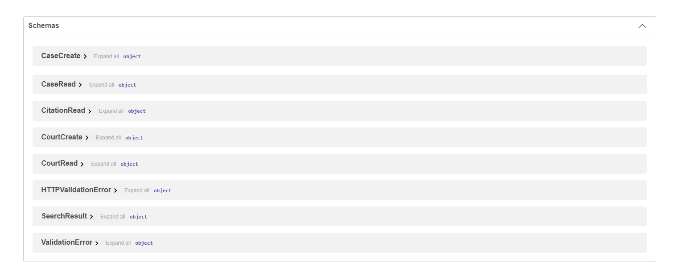

# CaseFlow

### Legal Data Engineering & Search Platform

CaseFlow is a production-style legal data platform for ingesting, validating, normalizing, searching, and retrieving court case data with traceable citations.

It combines backend engineering, structured data modeling, search, APIs, frontend workflows, testing, and product thinking in one end-to-end system.

### Stack

Python · FastAPI · PostgreSQL · SQLAlchemy · Alembic · React · Docker · Pytest

---

## Demo

### CaseFlow Dashboard


### API Documentation


### API Schemas



---

## The Problem

Legal research often involves fragmented sources, inconsistent metadata, and results that are difficult to trace back to their original source.

CaseFlow focuses on three core requirements:

1. **Reliable ingestion**
2. **Structured retrieval**
3. **Traceable results**

---

## The Solution

CaseFlow provides a structured workflow for turning legal source data into searchable, verifiable case information.

```text
External Legal Data
        |
        v
Ingestion Pipeline
        |
        v
Validation + Normalization
        |
        v
PostgreSQL
        |
        +------------------+
        |                  |
        v                  v
Search API          Citation API
        |                  |
        +--------+---------+
                 |
                 v
          FastAPI Backend
                 |
                 v
          React Dashboard
```

---

## Core Features

### Legal Data Ingestion

- structured ingestion workflow
- source validation
- court normalization
- case metadata validation
- duplicate protection
- content hashing

### Search

- case-name search
- court filtering
- decision-date filtering
- structured PostgreSQL queries
- API-based retrieval

### Citation-Aware Retrieval

CaseFlow preserves source metadata so users can trace retrieved case information back to its origin.

Supported metadata includes:

- source URL
- court information
- case identifiers
- docket number
- decision date
- opinion text

### REST API

FastAPI provides structured, validated endpoints with automatic OpenAPI documentation.

### React Dashboard

The dashboard provides a user-facing workflow for searching and reviewing case information.

---

## Data Model

### Courts

The `courts` table stores normalized court information.

Core fields:

- `id`
- `name`
- `abbreviation`
- `jurisdiction`
- `level`

### Cases

The `cases` table stores normalized legal case information.

Core fields:

- `id`
- `external_id`
- `case_name`
- `court_id`
- `decision_date`
- `docket_number`
- `opinion_text`
- `source_url`
- `content_hash`
- `created_at`
- `updated_at`

---

## Product + Engineering Decisions

### Why PostgreSQL?

Legal case data is structured and relational.

PostgreSQL provides:

- strong relational modeling
- indexing
- filtering
- mature SQL support
- reliable constraints
- production-grade consistency

### Why FastAPI?

FastAPI provides:

- automatic API documentation
- request validation
- type-driven development
- clear API contracts
- strong support for modern Python services

### Why preserve source metadata?

Traceability matters in legal workflows.

CaseFlow keeps source and citation information attached to retrieved case data so downstream users can verify where the information originated.

### Why separate ingestion from retrieval?

Separating ingestion, validation, storage, and retrieval makes the system easier to test, maintain, and extend.

It also creates a strong foundation for future semantic search and AI-assisted legal research.

---

## Reliability

CaseFlow includes reliability controls such as:

- unique external IDs
- content hashing
- schema validation
- database constraints
- foreign keys
- Alembic migrations
- automated tests
- source validation

---

## Testing

The project includes tests for:

- case workflows
- citations
- search
- ingestion
- source pipelines
- health endpoints
- court data
- citation parsing

Run the test suite with:

```bash
pytest
```

---

## Tech Stack

### Backend
- Python
- FastAPI
- SQLAlchemy
- Alembic
- Pydantic

### Database
- PostgreSQL

### Frontend
- React
- JavaScript / TypeScript

### Infrastructure
- Docker
- Docker Compose
- GitHub Actions

### Testing
- Pytest

---

## Project Structure

```text
caseflow-platform/
├── .github/
├── alembic/
├── app/
├── docs/
│   └── images/
├── frontend/
├── ingestion/
├── scripts/
├── tests/
├── .env.example
├── .gitignore
├── alembic.ini
├── docker-compose.yml
├── Dockerfile
├── README.md
└── requirements.txt
```

---

## Local Development

### 1. Clone the repository

```bash
git clone https://github.com/yakutswe/caseflow-platform.git
cd caseflow-platform
```

### 2. Create a virtual environment

```bash
python -m venv .venv
```

### 3. Activate the environment

Windows PowerShell:

```powershell
.venv\Scripts\Activate.ps1
```

macOS / Linux:

```bash
source .venv/bin/activate
```

### 4. Install dependencies

```bash
pip install -r requirements.txt
```

### 5. Configure environment variables

Copy:

```text
.env.example
```

to:

```text
.env
```

Then update the required local values.

### 6. Start PostgreSQL

```bash
docker compose up -d
```

### 7. Run migrations

```bash
alembic upgrade head
```

### 8. Start the backend

```bash
uvicorn app.main:app --reload
```

### 9. Open API documentation

```text
http://127.0.0.1:8000/docs
```

---

## Product Metrics

If CaseFlow were deployed in production, useful metrics would include:

- ingestion success rate
- duplicate rejection rate
- search latency
- API error rate
- citation coverage
- source validation success rate
- search success rate
- research time saved

---

## AI Readiness

CaseFlow is designed as a strong foundation for future AI-assisted legal research.

Potential extensions include:

- semantic search
- retrieval-augmented generation
- citation-aware answers
- case summarization
- source-grounded research
- hybrid keyword + semantic retrieval
- human-reviewed AI outputs

The core principle is simple:

**AI output should remain traceable to the underlying legal source data.**

---

## Roadmap

### Current

- legal case ingestion
- court normalization
- PostgreSQL data model
- search APIs
- citation support
- React dashboard
- Docker environment
- automated tests
- API documentation

### Next

- advanced search filters
- authentication
- user roles
- improved citation workflows
- audit history
- monitoring
- expanded source integrations

### Future

- semantic retrieval
- case relationship graph
- citation ranking
- AI-assisted legal research
- case summarization
- human-reviewed AI outputs
- production deployment
- observability

---

## Product Perspective

CaseFlow reflects how I approach product and engineering together:

```text
Problem
   |
   v
User Needs
   |
   v
Requirements
   |
   v
Architecture
   |
   v
Build
   |
   v
Validation
   |
   v
User Experience
   |
   v
Measurement
```

The project combines:

- product thinking
- backend engineering
- data modeling
- API design
- frontend workflows
- reliability
- AI-readiness

---

## Status

Active development.