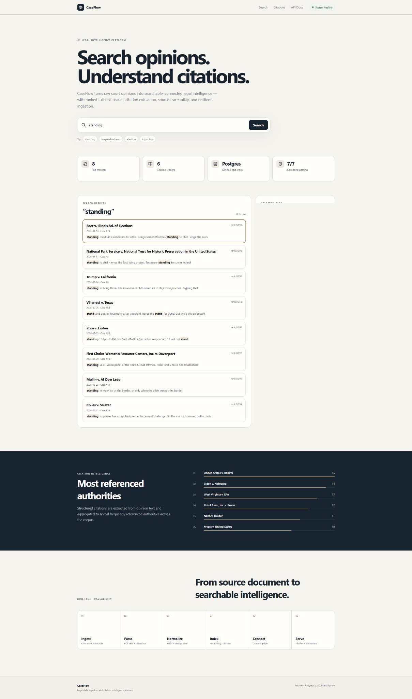
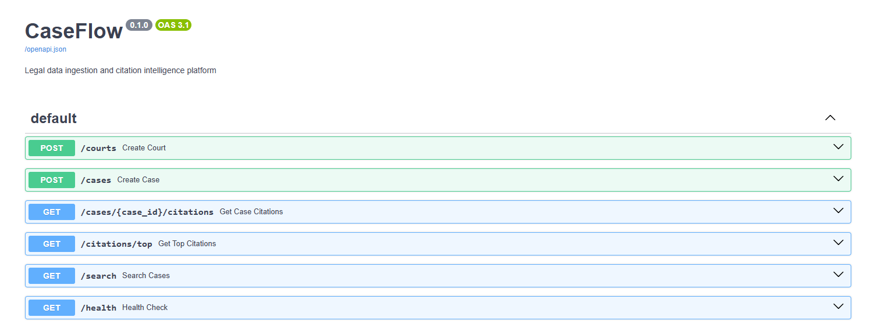

# CaseFlow

### Legal Data Engineering & Search Platform

CaseFlow is a production-style legal data platform for ingesting, normalizing, searching, and retrieving court case data with traceable citations.

It is designed to demonstrate how structured legal data can be transformed into a reliable search and research workflow using modern backend, database, API, and frontend technologies.

---

## Overview

CaseFlow combines:

- legal data ingestion
- structured normalization
- PostgreSQL-backed search
- citation-aware retrieval
- REST APIs
- React dashboard
- Dockerized local development
- automated testing
- CI workflows

The goal is not only to search legal records, but to make the underlying data easier to trust, inspect, and use.

---

## Product Problem

Legal researchers and analysts often work across fragmented sources, inconsistent case metadata, and difficult-to-trace search results.

CaseFlow is designed around three core needs:

1. **Reliable ingestion**
2. **Structured search**
3. **Traceable results**

---

## Target Users

### Primary Users
- Legal researchers
- Legal operations teams
- Attorneys
- Legal-tech product teams

### Secondary Users
- Data engineers
- AI/LLM teams building retrieval systems
- Compliance and research teams

---

## Product Goals

- Normalize inconsistent case data
- Make court and case metadata searchable
- Preserve source traceability
- Support future citation-aware AI workflows
- Provide a clean API for downstream applications
- Reduce manual research effort

---

## Architecture

```text
External Legal Data
        |
        v
Ingestion Pipeline
        |
        v
Validation + Normalization
        |
        v
PostgreSQL
        |
        +------------------+
        |                  |
        v                  v
Search API          Citation API
        |                  |
        +--------+---------+
                 |
                 v
          FastAPI Backend
                 |
                 v
          React Dashboard
---

## Demo

### Dashboard



### API Documentation

